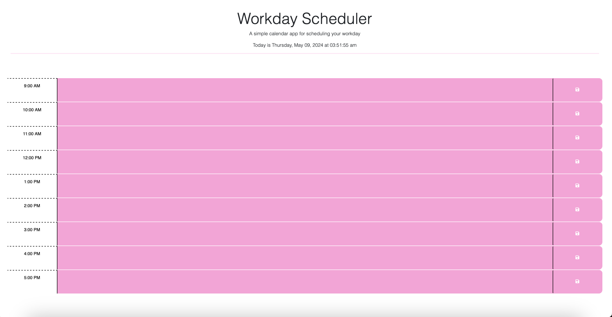

<div align="center">

<a href="./Assets/Images/Workday-Logo.jpg"></a>

# Workday Scheduler

<h3>A Simple Calendar Application to Plan Your Workday!</h3>

[](https://github.com/emsim11)   

[](https://emsim11.github.io/Workday-Scheduler/)

<p>
<a href="#description">Description</a> • 
<a href="#features">Features</a> • 
<a href="#installation">Installation</a> • 
<a href="#usage">Usage</a> • 
<a href="#support">Support</a> • 
<a href="#contributing">Contributing</a> • 
<a href="#credits">Credits</a> • 
<a href="#license">License</a>
</p>

</div>

## Description

The Workday Scheduler application is a simple calendar website that allows users to save events for each hour of a typical workday (9am–5pm). The application runs in the browser and uses local storage to retain the user's saved events.

### User Story

```md
As an employee with a busy schedule

I want to add important events to a daily planner

So that I can manage my time effectively
```

### Acceptance Criteria

```md
Given I am using a daily planner to create a schedule

When I open the planner

Then the current day is displayed at the top of the calendar

When I scroll down

Then I am presented with time blocks for standard business hours of 9am to 5pm

When I view the time blocks for that day

Then each time block is color-coded to indicate whether it is in the past, present, or future

When I click into a time block

Then I can enter an event

When I click the save button for that time block

Then the text for that event is saved in local storage

When I refresh the page

Then the saved events persist
```

[Back to Top](#workday-scheduler)

## Features

- Local storage to save events planned for the workday

- Dynamically updated HTML and CSS, powered by jQuery

- Displays current date and time using the Day.js library

[Back to Top](#workday-scheduler)

## Usage

To use the Workday Scheduler application, simply open the deployed URL in a web browser. From there, you can enter events in hour block that you plan to do it during. Next, click the save icon to the right of the hour block. Finally, bookmark the website so that you can easily return to your Workday Scheduler!

### Visuals

Below is a screenshot of the application BEFORE the workday has started:



[Back to Top](#workday-scheduler)

## Support

[](mailto:emsimone11@gmail.com)

*Contact Information:*

If you have any questions, or additional feedback, please feel free to contact me. I will get back to you as soon as possible.

*Submit an Issue:*

If you are experiencing an issue with this application, please submit an [issue ticket](https://github.com/emsim11/Workday-Scheduler/issues).

[Back to Top](#workday-scheduler)

## Contributing


This project is not allowing other contributors at this moment.

[Back to Top](#workday-scheduler)

## Credits

[](https://github.com/emsim11)

Here are listed the sources that helped make this project possible.

### Authors

*The following developers helped create this project:*

[Emily Simone](https://github.com/emsim11) - Main Developer

### Repository Information

  

[Back to Top](#workday-scheduler)

## License

[](https://choosealicense.com/licenses/mit/)

&copy; 2024 Emily Simone

This application is licensed under the [MIT License](./LICENSE).

[Back to Top](#workday-scheduler)